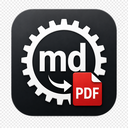

# MD2PDF Converter



**MD2PDF Converter** is a Visual Studio Code extension that exports Markdown documents to PDF using a local Chrome, Edge, or Chromium installation.

**Buy me a coffee**

If you'd like to thank me, you can buy me a coffee. Coffee is never too much :)

https://www.buymeacoffee.com/websvc

## Features

- Export Markdown to PDF beside the source Markdown file without prompting for a save path
- Export Markdown to PDF as ... from the Command Palette and Markdown context menus
- Front matter variables for header and footer templates
- Default header and footer layouts with left, center, and right sections
- GitHub-style Markdown rendering with syntax highlighted code blocks
- Inline HTML line break snippets such as `<br>` in Markdown content
- Inline HTML page break snippets such as `<pagebreak />` in Markdown content
- Layered custom stylesheets from built-in styles, project CSS, and front matter CSS paths
- Local PDF generation with no remote service dependency

## Requirements

MD2PDF Converter uses `puppeteer-core`, so a local Chrome, Edge, or Chromium executable must be available.

If your browser is installed in a non-standard location, set `md2pdf-converter.browserExecutablePath` in VS Code settings.

## Install

### From a local VSIX

1. Build and package the extension.
2. In VS Code or VS Code Insiders, open the Extensions view.
3. Select **Install from VSIX...** from the `...` menu.
4. Choose the generated `.vsix` file.

### From source for development

1. Clone the repository.
2. Run `npm install` in the project root.
3. Press `F5` in VS Code or VS Code Insiders to launch an Extension Development Host.

## Usage

1. Open a Markdown document.
2. Run **MD2PDF Converter: Export Markdown to PDF** to save `your-file.pdf` next to `your-file.md`.
3. Use **MD2PDF Converter: Export Markdown to PDF as ...** when you want to choose a different file name or location.

## Line breaks

To force a line break in exported output, use an inline HTML break snippet in your Markdown:

```md
First line<br>
Second line
```

## Page breaks

To force the next content onto a new PDF page, insert this HTML snippet in your Markdown:

```md
Section one

<pagebreak />

Section two
```

Use the snippet on its own line (block context). `<div class="page-break"></div>` is also supported.

## Stylesheets

Every exported document starts with the built-in MD2PDF Converter stylesheet.

You can then add two optional override layers:

1. A project stylesheet named `md2pdf-converter.css` or `md2pdf.css`. The nearest matching file above the Markdown document is loaded automatically.
2. A front matter stylesheet path under `md2pdf-converter.css`.

Effective precedence is:

1. Built-in MD2PDF Converter styles
2. Project stylesheet
3. Front matter stylesheet

Example:

```yaml
---
title: Styled Notes
md2pdf-converter:
  css: styles/pdf.css
---
```

The front matter path may be absolute, relative to the Markdown file, or project-relative if it can be found by walking up parent directories.

## Front matter variables

Front matter values are exposed to header and footer templates. Built-in variables include:

- `{{title}}`
- `{{fileName}}`
- `{{fileStem}}`
- `{{filePath}}`
- `{{generatedAt}}`
- `{{pageNumber}}`
- `{{totalPages}}`

Example:

```yaml
---
title: Sprint Notes
author: Ada Lovelace
project: MD2PDF Converter
md2pdf-converter:
  header:
    left: "{{project}}"
    center: "{{title}}"
    right: "Page {{pageNumber}} / {{totalPages}}"
  footer:
    left: "{{author}}"
    center: "internal"
    right: "{{generatedAt}}"
---
```

## Configuration

Default header and footer sections are configurable in VS Code settings:

- `md2pdf-converter.header.left`
- `md2pdf-converter.header.center`
- `md2pdf-converter.header.right`
- `md2pdf-converter.footer.left`
- `md2pdf-converter.footer.center`
- `md2pdf-converter.footer.right`
- `md2pdf-converter.page.format`
- `md2pdf-converter.page.margin.top`
- `md2pdf-converter.page.margin.right`
- `md2pdf-converter.page.margin.bottom`
- `md2pdf-converter.page.margin.left`
- `md2pdf-converter.browserExecutablePath`

## Development

See `docs/README.md` for developer setup, build, test, package, and publish instructions.

## License

[MIT](https://github.com/websvcPT/md2pdf/blob/master/LICENSE)

## Changelog

[CHANGELOG](https://github.com/websvcPT/md2pdf/blob/master/CHANGELOG.md)
